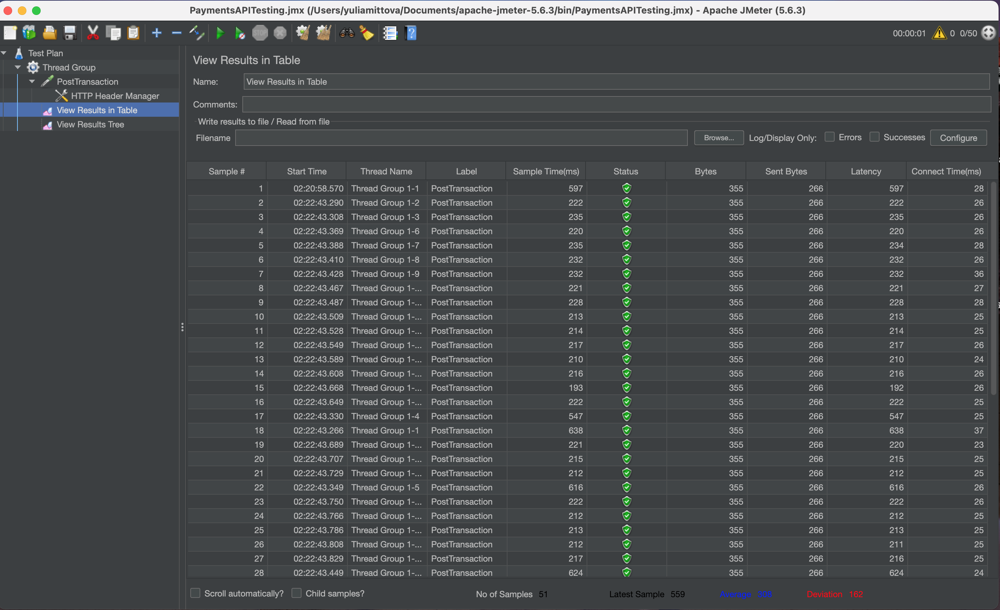

# Payment KMP App Challenge

## Setup
This is a KMP project which supports 2 banking operations: create transaction and see the list of transactions.
Backend API is created on Render. It is implemented as simple Spring Boot application with validation, created a Docker image and uploaded to Render:

```
@SpringBootApplication
@RestController
class PaymentApplication {

    @RequestMapping("/payments", method = [RequestMethod.POST], consumes = [MediaType.APPLICATION_JSON_VALUE])
    fun submit(@RequestBody request: PaymentRequest): ResponseEntity<String> {
        if (validateTransactionDetails(
                email = request.recipientEmail,
                amount = request.amount,
                currency = request.currency,
            )
        ) {
            return ResponseEntity.ok("Success")
        } else {
            return ResponseEntity.badRequest().body("The transaction details are invalid.")
        }
    }

    private fun validateTransactionDetails(email: String, amount: Double, currency: String) =
        validateEmail(email) && amount > 0.0 && SUPPORTED_CURRENCY_LIST.contains(currency)

    private fun validateEmail(email: String) =
        email.isNotEmpty() && email.isNotBlank() && email.matches(EMAIL_REGEXP)

    companion object {
        private val SUPPORTED_CURRENCY_LIST = listOf<String>("EUR", "USD")
        private val EMAIL_REGEXP = Regex(...)
        ...
    }
}
```

## Architecture
The app is implemented using KMP Compose and KMP shared logic.
* "composeApp/commonMain/screens" contains screen Compose logic, ViewModel and UIState
* "composeApp/commonMain/api" contains PaymentsApi for backend API integration (Ktor used) and FirestoreRepository to communicate to Firestore
* "composeApp/commonMain/data" contains objects for API and Firestore communication
* "composeApp/commonMain/di" for Koin configuration

##  How to run the app
To start the application it is enough to import it to Android Studio. After importing it you can choose your preferred emulator and run composeApp configuration.
Here is a short demo:
<video src="docResources/payments_demo.mp4" width="500" controls></video>

## Tests:
You can find  and the test results of 50 concurrent users:

